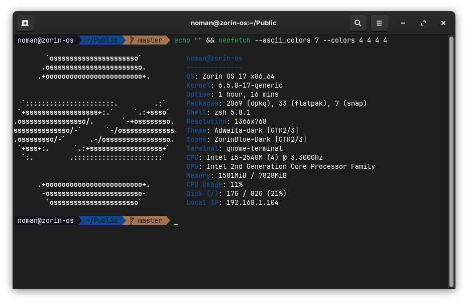

# shell-prettifier.sh

Shell Prettifier is a simple script that beautifies your terminal with plugins.



## Installation
**_Make sure to read the "IMPORTANT" warnings output carefully..._**<br>
To install Shell Prettifier, run the following commands:

```bash
git clone --depth 1 git clone https://github.com/TechWhizKid/shell-prettifier.git
```
```bash
cd shell-prettifier/
```
```bash
./shell-prettifier.sh # Don't run the script with sudo
```

Requires reboot for the changes to take effect.

**Note:** _Tested on "Zorin OS 17" and "Ubuntu 22.04 LTS"._

**Tip:** _To disable neofetch from launching with the terminal, you can modify the file `~/.zshrc` and comment out the last line from the file and save it._

## How to reset

If you want to revert to your old terminal settings, you can load the backup that was made by the `shell-prettifier.sh` script while installing using this command:

```bash
dconf load /org/gnome/terminal/legacy/profiles:/ < ~/terminal_profile_backup.dconf
```

Then, you can reset your shell back to bash with the following command:

```bash
chsh -s $(which bash)
```

Now you can remove the packages that were installed by the script, the packages are:

```bash
pv git git-core zsh neofetch curl
```

## Sources

|                            [Robby Russel OMZ](https://github.com/robbyrussel/oh-my-zsh)                             |
| :-----------------------------------------------------------------------------------------------------------------: |
| [Oh My Zsh guide!](https://medium.com/wearetheledger/oh-my-zsh-made-for-cli-lovers-installation-guide-3131ca5491fb) |
|                     [Syntax Highlighting](https://github.com/zsh-users/zsh-syntax-highlighting)                     |
|                        [Auto Suggestions](https://github.com/zsh-users/zsh-autosuggestions)                         |
|                                  [Agnoster Theme](https://gist.github.com/3712874)                                  |
